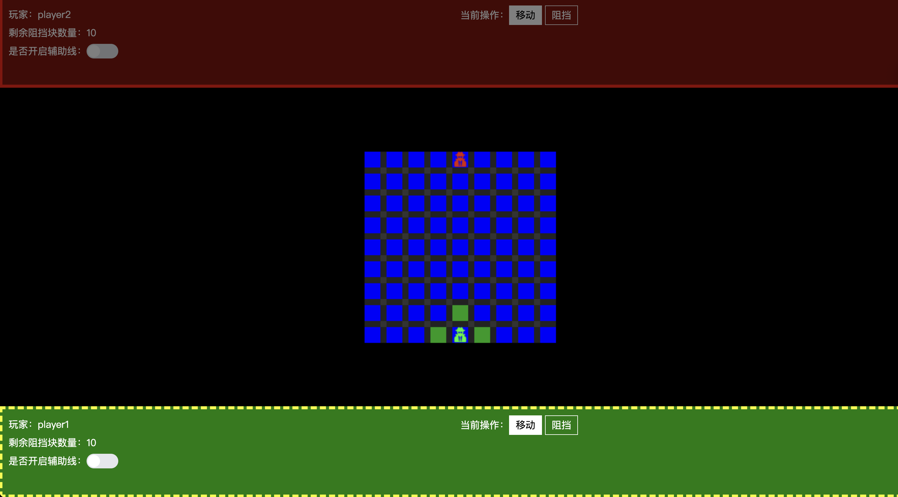
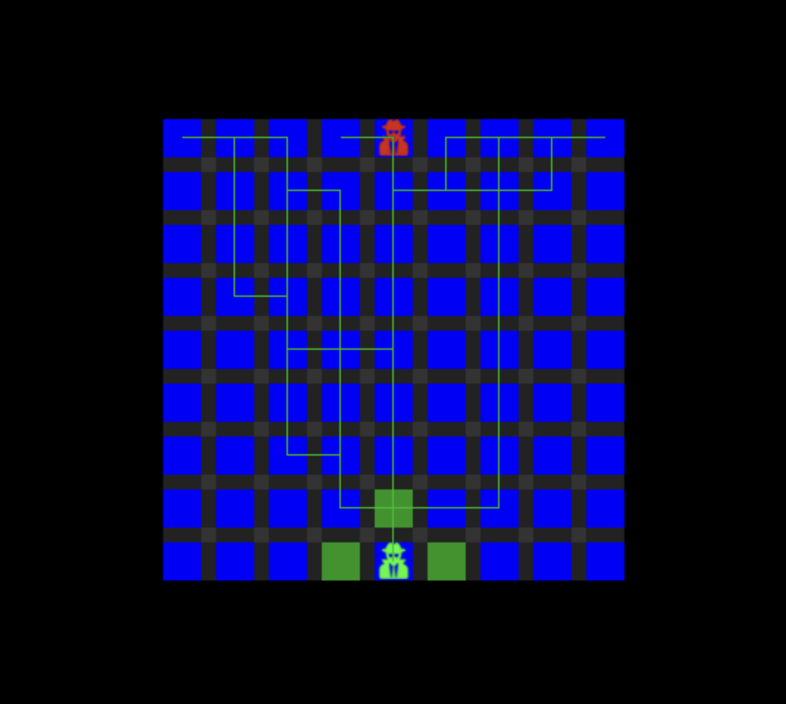
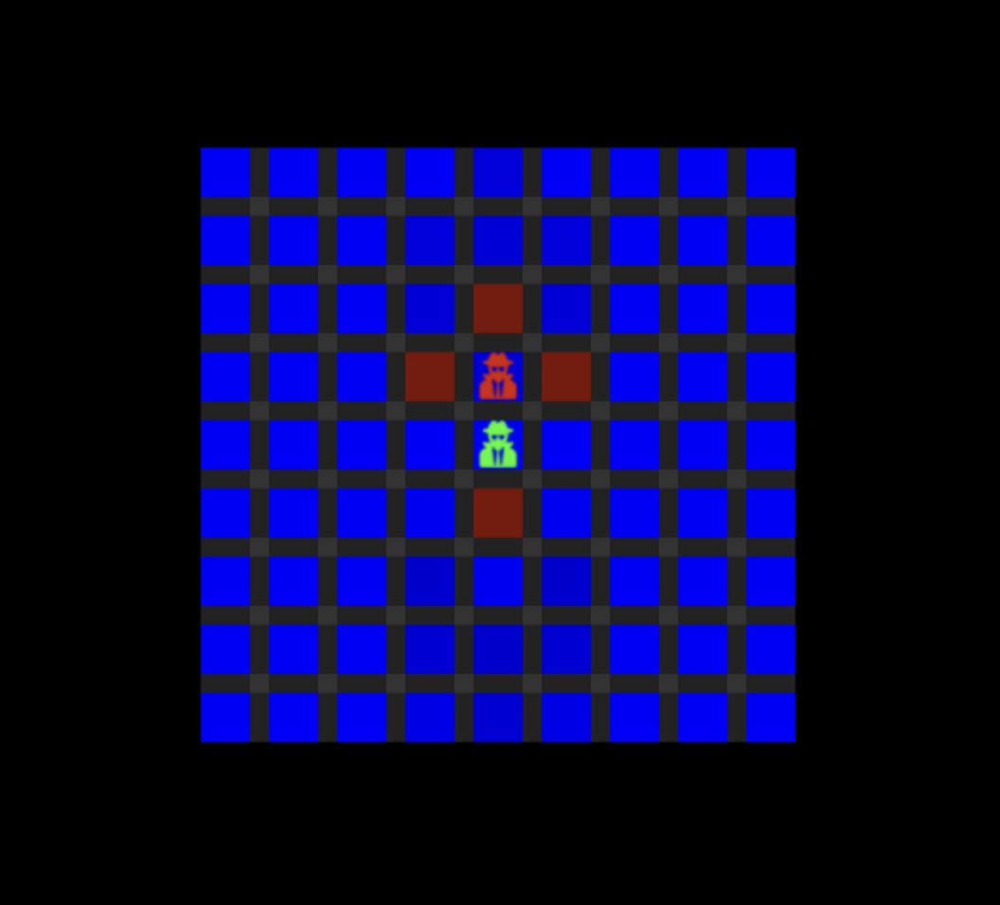
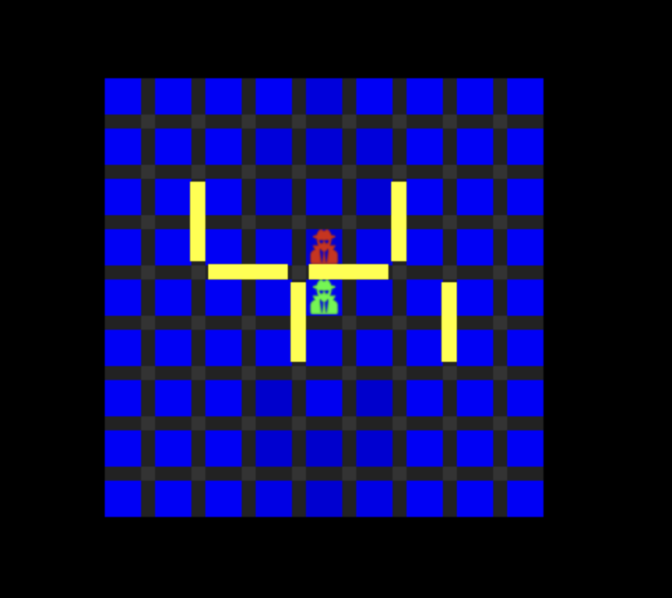
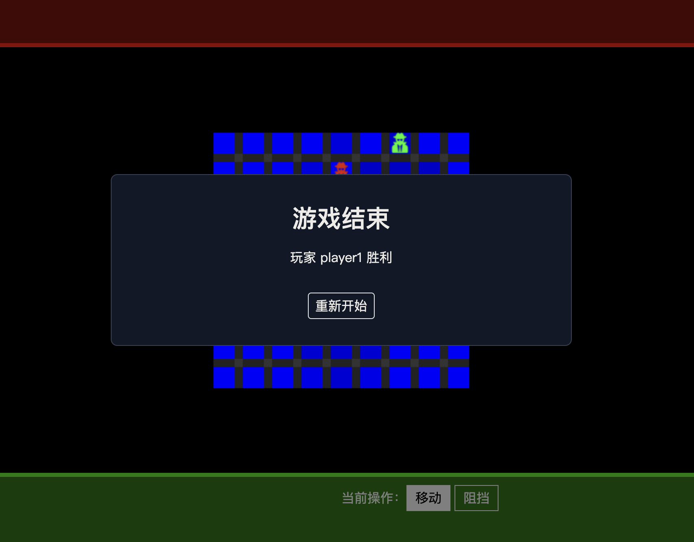

# 围追堵截

桌游《围追堵截》web版，使用 pixi.js 实现。


### 桌游《围追堵截》游戏规则说明
[游戏规则](./RULE.md)


### 在线DEMO
[在线体验](http://www.jiajialove.com/war-of-barriers/)

### 启动方式
```
    1. git clone git@github.com:jzllove9/war-of-barriers.git
    2. cd war-of-barriers
    3. 运行 `pnpm i`
    4. 运行 `pnpm dev`
```

### 技术栈
- pixi.js
- @tweenjs/tween.js
- easystarjs
- vue-final-modal
- vue3-toastify
- vue3
- vite


### 效果展示 
#### 游戏主界面

#### 辅助线

#### 移动

#### 阻挡

#### 游戏结束

