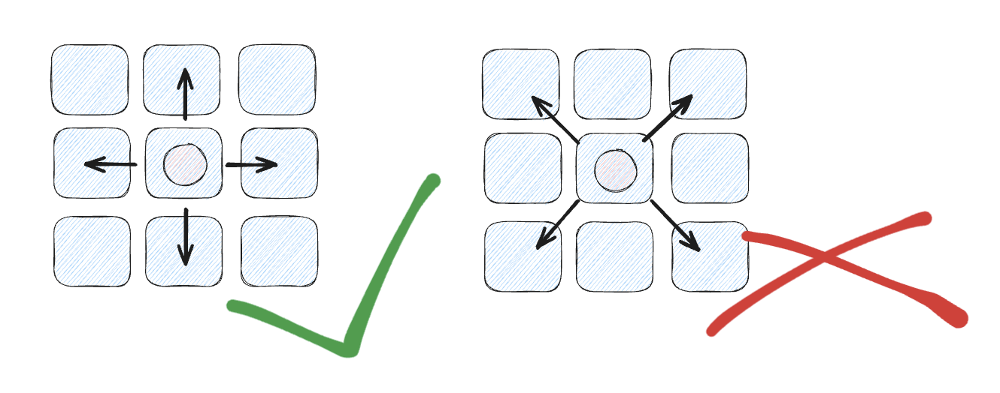
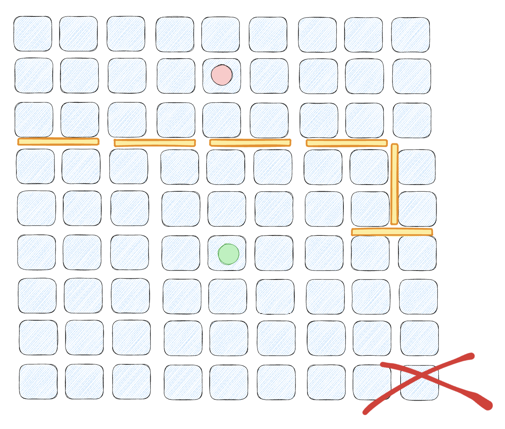

## 游戏规则 
- 起始状态
    - 棋子分别放在起始行最中间的方格上
    - 每位选手有十块木板
    
- 获胜条件
    - 使己方棋子先达到对方的`起始行`
- 游戏规则
    - 移动棋子向前、后、左、右任一方向移动一个方格(不能向对角线方向移动棋子)。
    
    - 在棋盘上的空槽中放置一块木板。木板可以水平或垂直摆放，但必须同时且只能挡住两个方格。
    
- 公平竞赛规则
    - 在放置木板时，不允许将所有对方可能获胜的道路完全“堵死”，否则视为输掉比赛。
    
- 面对面
    - 当双方的棋子在棋盘上相遇时，轮到行棋的选手可以将其棋子跳过对方的棋子，并直接落在对方棋子后面的方格内。
    - 如果对方棋子后面有木板，或者对方的棋子在棋盘的边缘，则该选手的棋子可以沿着对角线的方向跳过，落在对方棋子左右两侧的任何一侧。
    